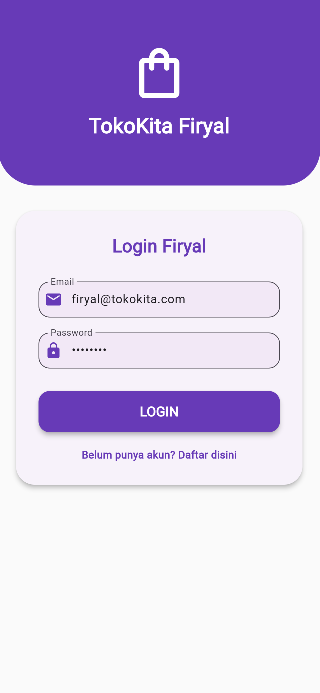

# 🛒 Tugas 8 - Pertemuan 10: CRUD API CodeIgniter 4 dan Flutter (Firyal)

Repositori ini berisi implementasi operasi CRUD (Create, Read, Update, Delete) Produk yang terintegrasi antara **Backend RESTful API** yang dibangun dengan CodeIgniter 4 dan **Frontend Mobile Application** yang dibangun dengan Flutter.

Proyek ini diselesaikan oleh **Firyal** sebagai tugas mata kuliah Pemrograman Mobile.


## Struktur Source Code Proyek
Proyek ini menggabungkan dua repositori utama: toko-api (Backend, CodeIgniter 4) dan tokokita (Frontend, Flutter).

1. Backend: CodeIgniter 4 (toko-api/)
Models (app/Models/): Berisi Model untuk interaksi database (misalnya MRegistrasi.php, MMember.php, MProduk.php).

Controllers (app/Controllers/): Berisi logika bisnis dan penanganan permintaan API:

RestfulController.php: Base Controller untuk standardisasi format respons JSON.

RegistrasiController.php: Menangani endpoint /registrasi (POST).

LoginController.php: Menangani endpoint /login (POST).

ProdukController.php: Menangani semua operasi CRUD untuk produk (/produk).

Routes (app/Config/Routes.php): Menentukan semua endpoint API (POST, GET, PUT, DELETE).

2. Frontend: Flutter (tokokita/)
lib/model/: Berisi struktur data Dart yang memetakan respons JSON dari API (misalnya login.dart, produk.dart, registrasi.dart).

lib/ui/: Berisi semua pages (halaman) dan tampilan aplikasi, di mana semua logika koneksi API (http) dan manajemen sesi (shared_preferences) ditanamkan langsung di dalam State masing-masing page.

lib/main.dart: Titik masuk aplikasi yang bertugas melakukan pengecekan sesi login dan mengarahkan pengguna ke LoginPage atau ProdukPage.
    ```

## 📸 Tampilan Aplikasi (Screenshots)

### 1. Halaman Login

Antarmuka halaman login.

| Tampilan Login | Keterangan |
| :---: | :--- |
|  | Halaman utama untuk memasukkan kredensial pengguna. |

### 2. Halaman Registrasi

Antarmuka halaman pendaftaran pengguna baru.

| Tampilan Registrasi | Keterangan |
| :---: | :--- |
|  | Halaman untuk membuat akun member baru. |

### 3. Halaman List Produk

Halaman utama setelah login, menampilkan daftar produk dengan nama **List Produk Firyal**.

| Tampilan List Produk | Keterangan |
| :---: | :--- |
|  | Menampilkan daftar produk statis (sementara) dan tombol untuk menambah produk. |

### 4. Halaman Detail Produk

Tampilan detail produk dengan opsi Edit dan Delete.

| Tampilan Detail Produk | Keterangan |
| :---: | :--- |
|  | Menampilkan detail produk dan tombol aksi (Edit, Delete). |

---

Setelah Anda *push* file `README.md` ini, Anda dapat menambahkan gambar `login.png`, `register.png`, dan *screenshot* lainnya ke *root* repositori Anda agar tautan gambar berfungsi.
