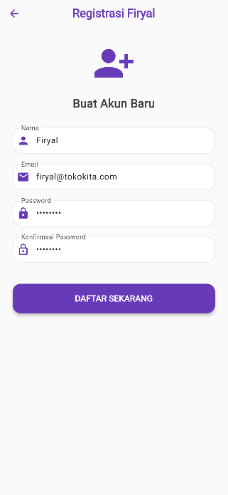

# 🛍️ TokoKita Firyal - Mobile E-Commerce App


**TokoKita Firyal** adalah aplikasi manajemen produk berbasis mobile yang dibangun dengan teknologi **Flutter** (Frontend) dan **CodeIgniter 4** (Backend API)  dilengkapi dengan sistem autentikasi token dan manajemen data produk (CRUD) yang terintegrasi.

---

## 📱 Dokumentasi & Alur Kerja Aplikasi

Berikut adalah dokumentasi langkah demi langkah penggunaan aplikasi beserta penjelasan kode backend dan logic di balik layar.

### 1. Proses Registrasi (Sign Up)

Langkah pertama bagi pengguna baru adalah mendaftarkan akun untuk mendapatkan akses ke dalam sistem.
Halaman ini menampilkan form input untuk **Nama**, **Email**, dan **Password**. Validasi dilakukan untuk memastikan data terisi dengan benar (misal: format email valid, password minimal 6 karakter).



**Penjelasan Proses:**
Pengguna menginputkan data diri. Ketika tombol **DAFTAR SEKARANG** ditekan, fungsi `_submit()` akan memanggil `RegistrasiBloc` untuk mengirim request HTTP POST ke API.

**Kode Implementasi:**
```dart
// lib/ui/registrasi_page.dart
void _submit() {
  _formKey.currentState!.save();
  // Mengirim data ke API via RegistrasiBloc
  RegistrasiBloc.registrasi(
      nama: _namaTextboxController.text,
      email: _emailTextboxController.text,
      password: _passwordTextboxController.text)
  .then((value) {
      // Tampilkan Dialog Sukses (Code 200)
      showDialog(..., builder: (context) => SuccessDialog(...));
  }, onError: (error) {
      // Tampilkan Dialog Gagal (Error API/Validasi)
      showDialog(..., builder: (context) => WarningDialog(...));
  });
}
