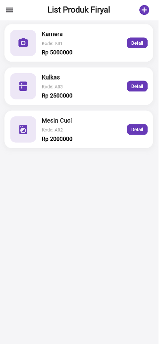
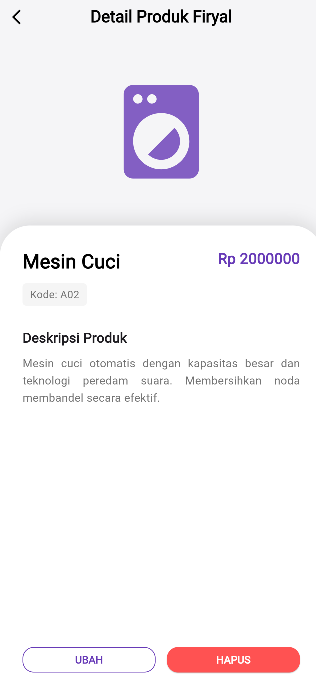
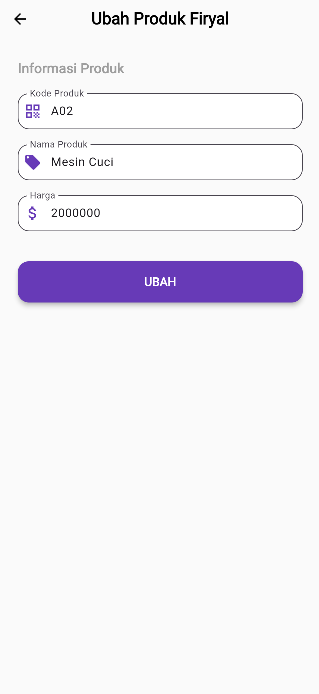
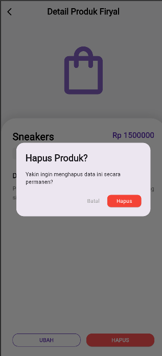
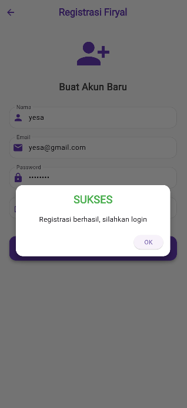
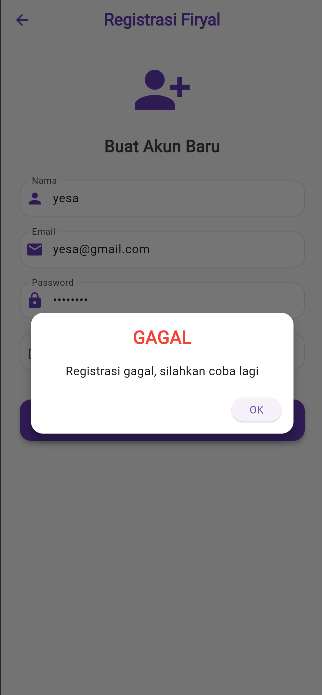

# TokoKita Firyal - Mobile E-Commerce App


**TokoKita Firyal** adalah aplikasi manajemen produk berbasis mobile yang dibangun dengan teknologi **Flutter** (Frontend) dan **CodeIgniter 4** (Backend API)  dilengkapi dengan sistem autentikasi token dan manajemen data produk (CRUD) yang terintegrasi.

---

## Dokumentasi & Alur Kerja Aplikasi

Berikut adalah dokumentasi langkah demi langkah penggunaan aplikasi beserta penjelasan kode backend dan logic di balik layar.

### 1. Proses Registrasi (Sign Up)

Langkah pertama bagi pengguna baru adalah mendaftarkan akun untuk mendapatkan akses ke dalam sistem.
Halaman ini menampilkan form input untuk **Nama**, **Email**, dan **Password**. Validasi dilakukan untuk memastikan data terisi dengan benar (misal: format email valid, password minimal 6 karakter).


**Penjelasan Proses:**
Pengguna menginputkan data diri. Ketika tombol **DAFTAR SEKARANG** ditekan, fungsi `_submit()` akan memanggil `RegistrasiBloc` untuk mengirim request HTTP POST ke API.

**Kode Implementasi:**
      ```dart
      // lib/ui/registrasi_page.dart
      void _submit() {
        _formKey.currentState!.save();
        // Mengirim data ke API via RegistrasiBloc
        RegistrasiBloc.registrasi(
            nama: _namaTextboxController.text,
            email: _emailTextboxController.text,
            password: _passwordTextboxController.text)
        .then((value) {
            // Tampilkan Dialog Sukses (Code 200)
            showDialog(..., builder: (context) => SuccessDialog(...));
        }, onError: (error) {
            // Tampilkan Dialog Gagal (Error API/Validasi)
            showDialog(..., builder: (context) => WarningDialog(...));
        });
      }


### 2. Proses Login (Sign In)

Setelah pengguna berhasil mendaftar, langkah selanjutnya adalah masuk ke dalam aplikasi menggunakan akun yang telah dibuat.

#### a. Form Login
Pengguna memasukkan **Email** dan **Password** pada halaman Login. Tampilan halaman ini didesain modern dengan *header* melengkung berwarna *Deep Purple*.


**Penjelasan Proses:**
1.  Pengguna mengisi kolom Email dan Password.
2.  Sistem melakukan validasi lokal (memastikan kolom tidak kosong).
3.  Ketika tombol **LOGIN** ditekan, aplikasi mengirim data kredensial tersebut ke server backend (CodeIgniter 4) untuk diverifikasi.

#### b. Logika Autentikasi & Penyimpanan Token
Jika kredensial valid, server akan mengembalikan respon sukses beserta **Token Akses**. Token ini sangat penting untuk disimpan agar pengguna tidak perlu login berulang kali.

**Kode Implementasi:**
Pada file `lib/ui/login_page.dart`, fungsi `_submit` menangani logika ini:
    
    ```dart
    // lib/ui/login_page.dart
    void _submit() {
      _formKey.currentState!.save();
      
      // 1. Memanggil LoginBloc untuk request ke API
      LoginBloc.login(
          email: _emailTextboxController.text,
          password: _passwordTextboxController.text)
      .then((value) async {
          
          // 2. Cek Kode Respon (200 = Berhasil)
          if (value.code == 200) {
              
              // 3. Simpan Token & UserID ke SharedPreferences (Memori Lokal)
              await UserInfo().setToken(value.token.toString());
              await UserInfo().setUserID(int.parse(value.userID.toString()));
              
              // 4. Redirect ke Halaman Utama (List Produk)
              Navigator.pushReplacement(context,
                  MaterialPageRoute(builder: (context) => const ProdukPage()));
                  
          } else {
              // Jika Gagal (Password salah / Email tidak ditemukan)
              showDialog(
                  context: context,
                  builder: (BuildContext context) => const WarningDialog(
                      description: "Login gagal, silahkan coba lagi",
                  ));
          }
      }, onError: (error) {
          // Jika terjadi kesalahan koneksi
          showDialog(
              context: context,
              builder: (BuildContext context) => const WarningDialog(
                  description: "Login gagal, silahkan coba lagi",
              ));
      });
    }

### 3. Dashboard List Produk (Read)

Setelah berhasil login, pengguna akan diarahkan ke halaman utama yang menampilkan seluruh data produk yang tersimpan di database.

#### a. Tampilan Daftar Produk
Halaman ini dirancang untuk memuat data secara otomatis saat dibuka (*auto-fetch*). Setiap kartu produk menampilkan informasi penting seperti **Ikon Kategori** (Kamera, Kulkas, dll), **Nama Produk**, **Kode**, dan **Harga**.



**Penjelasan Kode Implementasi:**
Aplikasi menggunakan widget `FutureBuilder` untuk menangani proses pengambilan data yang bersifat *asynchronous*.
* Saat data sedang diambil, aplikasi menampilkan *CircularProgressIndicator* (Loading).
* Setelah data diterima, aplikasi merender widget `ListProduk`.

    ```dart
    // lib/ui/produk_page.dart
    
    body: FutureBuilder<List<Produk>>(
      // Memanggil fungsi fetch data dari BLoC
      future: ProdukBloc.getProduks(), 
      
      builder: (context, snapshot) {
        // Penanganan Error
        if (snapshot.hasError) print(snapshot.error);
        
        // Logika Tampilan: Ada Data vs Loading
        return snapshot.hasData
            ? ListProduk(list: snapshot.data) // Tampilkan List jika sukses
            : const Center(child: CircularProgressIndicator()); // Tampilkan Loading saat proses
      },
    ),

### 4. Proses Tambah Produk (Create)

Fitur ini memungkinkan admin untuk menambahkan stok barang baru ke dalam inventaris toko.

#### a. Form Input Produk
Form ini meminta input **Kode Produk**, **Nama Produk**, dan **Harga**. Desain input field dibuat *rounded* agar konsisten dengan tema aplikasi.


**Logika Penyimpanan:**
Fungsi `simpan()` pada `produk_form.dart` bertugas membungkus data input ke dalam objek Model `Produk` dan mengirimkannya via BLoC.

**Kode Implementasi:**
    ```dart
    // lib/ui/produk_form.dart
    
    void simpan() {
      // 1. Membungkus data form ke object Produk
      Produk createProduk = Produk(id: null);
      createProduk.kodeProduk = _kodeProdukTextboxController.text;
      createProduk.namaProduk = _namaProdukTextboxController.text;
      createProduk.hargaProduk = int.parse(_hargaProdukTextboxController.text);
    
      // 2. Request POST ke API via BLoC
      ProdukBloc.addProduk(produk: createProduk).then((value) {
        // 3. Jika sukses, kembali ke halaman list dan refresh data
        Navigator.of(context).push(MaterialPageRoute(
            builder: (BuildContext context) => const ProdukPage()));
      }, onError: (error) {
        // 4. Jika gagal, tampilkan dialog warning
        showDialog(
            context: context,
            builder: (BuildContext context) => const WarningDialog(
                  description: "Simpan gagal, silahkan coba lagi",
                ));
      });
    }
    
### 5. Detail Produk (Read Detail)

Halaman ini menampilkan informasi mendalam mengenai produk yang dipilih dari daftar utama.

#### a. Tampilan Detail
Menggunakan desain *bottom sheet style* (kartu putih dengan sudut melengkung di bagian atas) dan ikon produk berukuran besar di bagian header untuk memberikan fokus visual.




**Kode Implementasi:**
Pada file `produk_detail.dart`, fungsi `_getIconForProduct` melakukan pengecekan string nama produk.

    ```dart
    // lib/ui/produk_detail.dart
    
    Widget _getIconForProduct(String name) {
      // Logika penentuan ikon berdasarkan kata kunci
      if (name.toLowerCase().contains('kamera')) {
        return Icon(Icons.camera_alt, size: 150, color: _primaryColor);
      } else if (name.toLowerCase().contains('mesin cuci')) {
        return Icon(Icons.local_laundry_service, size: 150, color: _primaryColor);
      } else if (name.toLowerCase().contains('kulkas')) {
        return Icon(Icons.kitchen, size: 150, color: _primaryColor);
      }
      // Default Icon jika tidak ada kata kunci yang cocok
      return Icon(Icons.shopping_bag_outlined, size: 150, color: _primaryColor);
    }

### 6. Proses Ubah Produk (Update)

Fitur ini memungkinkan admin untuk memperbarui informasi produk yang sudah ada di database.

#### a. Form Edit Produk
Saat tombol "UBAH" ditekan di halaman detail, pengguna diarahkan ke form ini. Kolom-kolom akan **terisi otomatis (*Pre-filled*)** dengan data produk yang sedang diedit, dan judul halaman berubah menjadi **"Ubah Produk Firyal"**.



**Logika Update:**
Fungsi `ubah()` pada `produk_form.dart` akan mengirim permintaan pembaruan (*request PUT*) ke API berdasarkan ID produk.

**Kode Implementasi:**
    ```dart
    // lib/ui/produk_form.dart
    
    void ubah() {
      // 1. Menyiapkan objek produk dengan ID yang sedang diedit
      Produk updateProduk = Produk(id: widget.produk!.id!);
      
      // 2. Mengambil data baru dari text controller
      updateProduk.namaProduk = _namaProdukTextboxController.text;
      updateProduk.kodeProduk = _kodeProdukTextboxController.text;
      updateProduk.hargaProduk = int.parse(_hargaProdukTextboxController.text);
    
      // 3. Request PUT ke API via BLoC
      ProdukBloc.updateProduk(produk: updateProduk).then((value) {
         // Jika sukses, kembali ke halaman list untuk melihat perubahan
         Navigator.of(context).push(MaterialPageRoute(
            builder: (BuildContext context) => const ProdukPage()));
      }, onError: (error) {
         // Jika gagal, tampilkan dialog warning
         showDialog(
            context: context,
            builder: (BuildContext context) => const WarningDialog(
                  description: "Permintaan ubah data gagal, silahkan coba lagi",
                ));
      });
    }

### 7. Proses Hapus Produk (Delete)

Menghapus data produk dari database secara permanen.

#### a. Konfirmasi Penghapusan
Aplikasi memunculkan *Dialog Konfirmasi* untuk mencegah penghapusan yang tidak disengaja.



**Kode Implementasi:**
Saat tombol "Hapus" pada dialog ditekan, fungsi akan memanggil `ProdukBloc.deleteProduk` dengan mengirimkan ID produk.

    ```dart
    // lib/ui/produk_detail.dart
    
    void confirmHapus() {
      AlertDialog alertDialog = AlertDialog(
        content: const Text("Yakin ingin menghapus data ini secara permanen?"),
        actions: [
          OutlinedButton(child: Text("Batal"), onPressed: () => Navigator.pop(context)),
          ElevatedButton(
            child: Text("Hapus"),
            style: ElevatedButton.styleFrom(backgroundColor: Colors.red),
            onPressed: () {
              // 1. Panggil API Delete via BLoC
              ProdukBloc.deleteProduk(id: int.parse(widget.produk!.id!)).then((value) {
                  // 2. Jika sukses, kembali ke halaman List Produk
                  Navigator.of(context).push(MaterialPageRoute(
                      builder: (context) => const ProdukPage()));
              });
            },
          )
        ],
      );
      showDialog(builder: (context) => alertDialog, context: context);
    }

### 8. Custom Widget (Feedback Dialog)

Aplikasi ini menggunakan *reusable widget* untuk memberikan umpan balik (feedback) yang konsisten kepada pengguna, baik saat proses berhasil maupun gagal.

#### a. Dialog Sukses & Gagal
Dialog ini muncul otomatis setelah respon dari API diterima.

| Success Dialog ✅ | Warning Dialog ❌ |
| :---: | :---: |
|  |  |

**Kode Implementasi Widget:**

Aplikasi memisahkan UI dialog ke dalam folder `lib/widget/` agar kodenya bersih dan mudah digunakan kembali di halaman mana saja.

**`lib/widget/success_dialog.dart`**
    ```dart
    class SuccessDialog extends StatelessWidget {
      // ... constructor ...
      
      @override
      Widget build(BuildContext context) {
        return Dialog(
          backgroundColor: Colors.transparent,
          child: Container(
            decoration: BoxDecoration(
              color: Colors.white,
              borderRadius: BorderRadius.circular(16.0),
            ),
            child: Column(
              children: [
                const Text("SUKSES", style: TextStyle(color: Colors.green, fontWeight: FontWeight.bold)),
                Text(description!),
                ElevatedButton(onPressed: () => okClick!(), child: const Text("OK"))
              ],
            ),
          ),
        );
      }
    }
